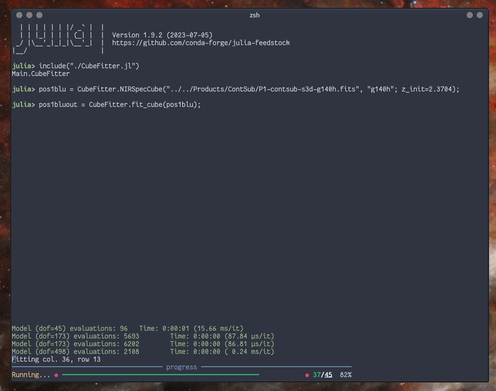

# CubeFitter

[](https://github.com/thriveth/CubeFitter.jl/actions/workflows/CI.yml?query=branch%3Amain)

## Introduction

A package for automatically fitting emission lines in astronomical spectral cubes.
Hopefully, this could develop into a more general package for handling spectral cubes in
Julia.

Development is still in early days, so everything may break - but currently, the NIRSpec
related code _Works For Me™_. I am in the process of testing it for MUSE, and most other
instruments should be quite easy to add as well.


## What does it do (and how)?

The workhorses of this package are the various `struct`'s `NIRSpecCube`, `MUSECube`, etc.;
as well as the functions `fit_cube()`, and `fit_spectrum_from_subcube()`.


## Enabling the package

This package is not yet registered to install (maybe later). To run it now, clone the
repository to your preferred location; then:

```julia
julia> import Pkg
julia> Pkg.activate("/path/to/CubeFitter.jl")
julia> Pkg.instantiate()  # Install dependencies, needs only be done once.
julia> using CubeFitter
```

Alternatively, you can enter the `Pkg>` prompt, run `activate /path/to/CubeFitter.jl`,
then (first time) `instantiate()`. Press Backspace to return to the normal `julia>`
prompt, and run `using CubeFitter`. 


## Example usage

A simple example of a session using `CubeFitter.jl`:

```julia
julia> cube = NIRSpecCube("/path/to/datacube.fits")
julia> out = fit_cube(cube)
julia> write_to_fits("/desired/path/to/output/file.fits", out)
```

It is assumed that the data in datacube.fits is already continuum subtracted. 

This code will return a dictionary of $N\times M \times 3$ arrays, one for each fitted line, as
well as one for the 0th to 2nd moment, the spaxel-wise redshift, and line width. Each
such array will have the measured values as the first slice, the parameter error in the
second slice, and the fit statistics in the last. Each of these slices will be saved as an
individual HDU in the output FITS file.

The function fit_cube is mainly a convenience function enabling one to cycle through every
spaxel in the cube, and running the fits with default settings. One can also use the
function `fit_spectrum_from_subcube()` directly. This function allows to extract a
spectrum from the cube based on an x- and y range passed to it (this must always be a
range; if only one spaxel is wanted, give the range for the spaxel (_i_, _j_) as
`xrange=i:i, yrange=j:j`). The function extracts a simple, un-weighted spectrum over the
given (_x, y_) range, runs the fit, and return a dictionary of the fit results and
statistics, along with the extracted spectrum, errors, and wavelength range for
convenience. See the function docstring to learn more.


## Screens

There really isn't much to look at but here it is:




## Planned features / whishlist

In order of approximate priority: 

- [ ] Test and ensure the `MUSECube` struct actually works as advertised
- [ ] Allow for measuring flux or upper limits in lines that are currently excluded as
      having too low S/N ratio.
- [ ] Make it possible to add a second and perhaps third kinematic component. 
- [ ] Add support for more instruments. Suggestions welcome (especially if accompanied
      with a suitable test dataset).
- [ ] Write quicklook-functions allowing to quickly view the fit outputs with minimum
      input. But still be tinker-friendly, don't hide stuff from the user.
